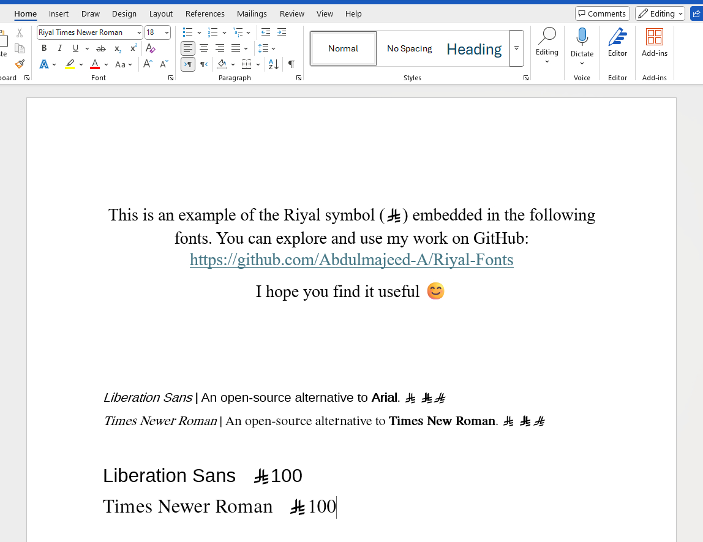
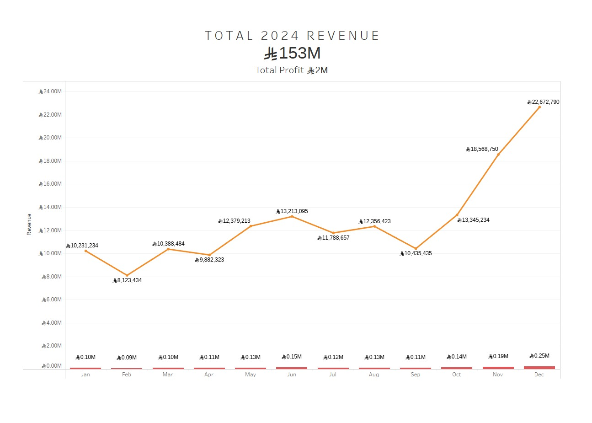

# Fonts with the Saudi Riyal Symbol

Hi there! 👋

If you want to use the **Saudi Riyal symbol** as text, I’ve modified these fonts for you! 😊  
This is a temporary solution until the symbol becomes part of the Universal Character Set (UCS).

 

## 🔤 Fonts Featuring the Riyal Symbol

- **Riyal Liberation Sans** – An open-source alternative to `Arial`.
- **Riyal Times Newer Roman** – An open-source alternative to `Times New Roman`.

## 🚀 How to Use

The **Riyal symbol (  )** replaces the tilde (`~`) key on your keyboard.  
Simply type `~` while using the font, and it will display the Riyal symbol.

## 💾 Installation Guide

### 🖥️ Windows

1. Download the font files from this repository.
2. Right-click the font file and select **"Install"**.
3. The font will now be available in applications like Word, Photoshop, etc.

### 🍏 macOS

1. Download the font files from this repository.
2. Double-click the font file to open it in **Font Book**.
3. Click **"Install Font"**.
4. The font is now available for use in all applications.

## 📌 Important Notes

Custom fonts are not universally available on all devices. When a document, website, or design specifies a particular font, the system displaying it must have that font installed. If the font is missing, the device will substitute a default font, which can alter the intended appearance.

### ✅ Ensuring Custom Fonts Display Correctly

To maintain font consistency across different devices and platforms, consider these methods:

- **Font Embedding in Documents** – Some file formats (such as Word and PowerPoint) allow font embedding, ensuring the correct font appears on other devices.
- **Web Font Hosting** – Websites can use `@font-face` in CSS to load fonts from a server, making them accessible across browsers and devices.
- **Converting Text to Outlines** – In design software, text can be converted into vector shapes, preserving its appearance regardless of font availability.
- **Using PDFs** – PDF files support font embedding, ensuring text remains visually consistent across different devices.

If a custom font does not appear as expected, it is likely due to missing font embedding, installation issues, or incorrect referencing.

## ✨ Examples

Here’s how the Riyal symbol appears in different fonts/apps:

Microsoft Word:

Tableau:

## 📜 License

These fonts are open-source (GPL/OFL) and available for personal and commercial use.

---

Enjoy using the Riyal symbol! 🎉  
If you find this useful, **give this repo a ⭐!**
